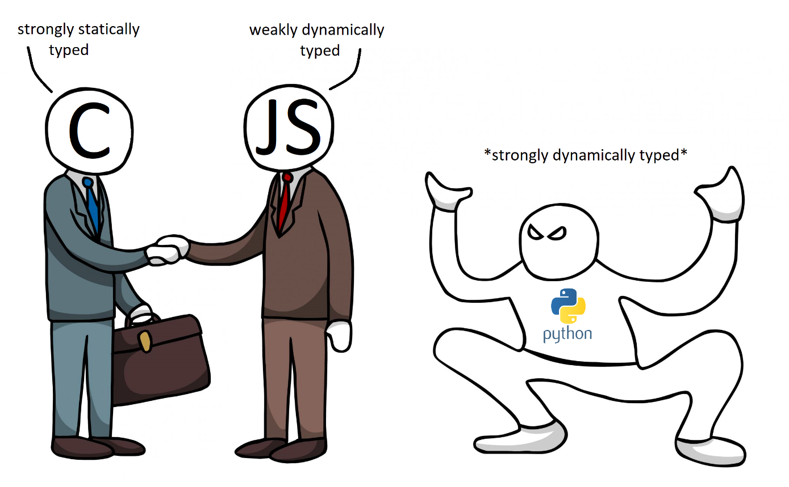

# Python - Variable Annotations

Introducing type annotation in python (strongly dynamically-typed).

## Learning Objectives :

+ Type annotations in Python 3
+ How you can use type annotations to specify function signatures and variable types
+ Duck typing
+ How to validate your code with mypy
